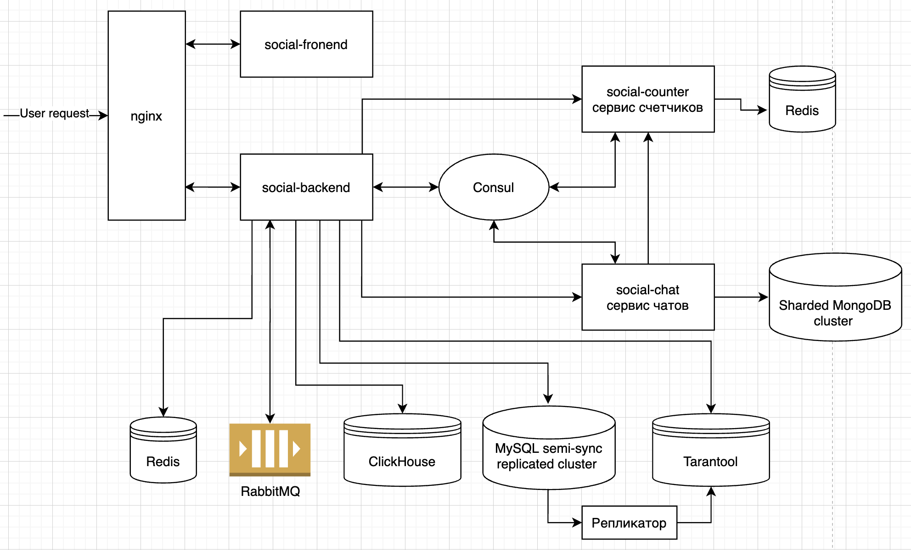

# Социальная сеть

- Репа - https://hub.docker.com/repository/docker/alexyakovlev90/ay-social
- Docker образ - https://hub.docker.com/repository/docker/alexyakovlev90/ay-social
- Приложение в AWS - http://ec2-18-195-119-80.eu-central-1.compute.amazonaws.com:8080/


## Архетектура




### Приложение состоит из 3х backend сервисов

1) social-backend - основной бэкенд соцсети
  - В качестве БД сервис использует реплицированный MySQL кластер
    - Анализ нагрузки индексов [тут](./index-load-test/hw3-search-report.md)
    - Анализ работы репликации [тут](./replication/hw4-master-slave-load/hw4-replication-load.md)
    - сервис использует полусинхронную репликацию – [подробнее](./replication/hw5-semi-sync/hw5-semi-sync-test.md)
  - для поиска по пользователям используется репликация пользователей в Tarantool – [подробнее](./in-memory-tarantool/hw7-tarantool-replication.md)
  - работа ленты новостей использует PUB/SUB RabbitMQ, обновления складываются в Redis кэш – [подробнее](./rabbit-redis/hw8-redis-rabbit.md) 
  - для аналитики данные чз буфферизатор KittenHouse реплицируются в ClickHouse – [подробнее](./clickhouse/hw9-clickhouse.md)

2) social-chat - сервис чатов
  - Модель Данных разделена на чаты и сообщения, для возможности доработки для групповых чатов
  - взаимодействие с сервисом осуществляется по GRPC – [подробнее](./grpc-chats/grpc-chats-report.md)
  - В качестве БД выбрана NoSQL хранилище MongoDB (шардированный кластер)
  - подробное [описание](./sharding/sharding-report.md) работы сервиса с MongoDB
  - предусмотерено горизонтальное масштабирование на запись с помощью шардинга

3) social-counter сервис счетчиков (in progress)
  - Сервис хранит число непрочитанных сообщений
  - на сервис предполагается большая нагрузка на чтение
  - Для хранения использует Redis
  - консистентность между счетчиком и реальным числом непрочитанных сообщений по паттерну SAGA
 
  
### Дополнительно  
- все сервисы обернуты в docker и используют auto discovery сервисов с помощью consul – [подробнее](./consul-docker/hw13-consul.md)  
- для сервисов и инфраструктуры реализован сбор метрик и мониторинг – [подробнее](./monitoring/hw15-monitoring.md)
- сервисы предусматривают горизонтальное масштабирование, 
  доступ к сервисам [через Nginx](./load-balancing/hw11-load-balancing.md)
- доступ к slave репликам MySQL осуществляется через HAProxy, 
  что позволяет горизонтально масштабировать нагрузку на чтение


## Потенциальные проблемы
1) Падение узла сервиса
  - тк сервисы горизонтально масштабируемы, а доступ к сервисам осуществляется через балансировщик,
    можно свободно выводить сервисы из балансировки при настроенном http health check
    
2) Падение/неисправность Redis или Tarantool
  - Redis/Tarantool необходимо реплицировать
  - Для лент новостей возможна высокая нагрузка на запись (кол-во постов х активные юзеры) 
    при большой нагрузке на запись необходимо будет шардировать
  - Можно поставить Hystrix (latency and fault tolerance library), чтобы при неисправном Redis ходить в БД
  - При неисправном Redis/Tarantool можно отключить онлайн обновление ленты, поиск пользователей  

3) Падение слейва в Mysql
  - тк используется балансировщик для доступа к репликам, пользователь не заметит падение слейва,
  но необходимо держать нагрузку на оставшихся репликах
  - до момента починки и ввода неисправного слейва часть трафика на чтение можно пустить на мастер

3) Падение мастера в Mysql
  - Запрещаем запись
  - запускаем [скрипт](./replication/hw5-semi-sync/docker-mysql-semi-sync/promote.sh) промоут слейва в мастера
  - обновляем настройки балансера либо адресс мастера в Consul
  - Падение мастера описано [тут](./replication/hw5-semi-sync/hw5-semi-sync-test.md)

4) Падение мастера шарда MongoDB
  - Если шарды реплицируются, отключаем запись до промоута реплики в мастер
  - Если шарды не имеют реплик
    - Запрещаем запись
    - меняем зоны упашего шарда на новые шарды – https://docs.mongodb.com/manual/core/zone-sharding/
    - Разрешаем запись 
    - Мигрируем записи упавшего шарда


## Недостатки архитектуры
- Хранение / обновление сообщений ленты новостей стоит вынести в отдельный сервис с отдельным хранением
  - Данных потенциально очень много
  - Высокая нагрузка на чтение/запись
- Сервис счетчиков - можно писать данные в персистентное хранилище и реплицировать в ClickHouse для построения аналитики
- Нет системы сбора и анализа логов
- Для всех сервисов стоит сделать доступ через Reverse Proxy и для возможности горизонтального масштабирования


## Environmental vars used:
- DB_URL - full DB URL with DB name, otherwise H2 file DB used
- JDBC_DRIVER - JDBC driver. Supported drivers:
  - com.mysql.jdbc.Driver - for mySql
  - org.postgresql.Driver - for Postgres
  - org.h2.Driver - for H2 DB (default)
- DB_USERNAME - DB username
- DB_PASSWORD - DB password


## Working tips
### MySQL in Docker
```shell script
docker run --name=mysql \
  -e MYSQL_ROOT_HOST=% -e MYSQL_ROOT_PASSWORD=ay_1 -p 3306:3306 \
  -d mysql/mysql-server:8.0.1

# login into mysql
docker logs mysql 2>&1 | grep GENERATED # check the automatically generated password of root user, copy it
docker exec -it mysql mysql -u root -p # parse and press the Enter key

ALTER USER 'root'@'localhost' IDENTIFIED BY '<password>';
create database ay_social;
GRANT ALL PRIVILEGES ON *.* TO 'ay'@'localhost' IDENTIFIED BY 'ay_pass';
```

### wrk - a HTTP benchmarking tool
- https://github.com/wg/wrk
```shell script
wrk -t1 -c1 -d5s -s ./load-test/wrk/search-test.lua --latency http://localhost:9090/swagger-ui.html
```

### tarantool
- https://www.tarantool.io/ru/doc/1.10/reference/reference_lua/box_space/
```shell script
# create space
box.schema.space.create('myspace', {if_not_exists=true})

# имя 'primary', тип дерево, уникальный. part - индекс по 1й колонке (целое число). и 2й колонке строке  
box.space.myspace:create_index('primary', {type="TREE", unique=true, parts={1, 'unsigned', 2, 'string'}, if_not_exists=true})
box.space.myspace:create_index('tindex', {type="TREE", parts={3, 'unsigned'}, unique=false})
box.space.myspace:create_index('hindex', {type="HASH", parts={1, 'unsigned'}})

space = box.schema.space.create('tester')
box.space.tester:create_index('primary', {type = 'hash', parts = {1, 'NUM'}})
box.schema.user.create('test', { password = 'test' })
box.schema.user.grant('test', 'execute,received,write', 'universe')
box.space.tester:format{{name='id',type='num'},{name='text',type='str'}}

dofile('/opt/tarantool/init.lua')
```
