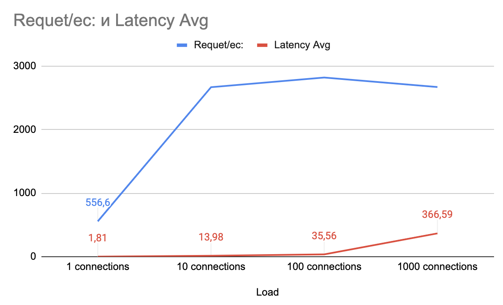

# Производительность индеков

## Запрос для поиска анкет по префиксу имени и фамилии (одновременно)
```sql
SELECT * FROM user WHERE first_name like '%' and last_name like '%' LIMIT 100;
```
- План запроса без индекса
```
+--+-----------+-----+----------+----+-------------+----+-------+----+------+--------+-----------+
|id|select_type|table|partitions|type|possible_keys|key |key_len|ref |rows  |filtered|Extra      |
+--+-----------+-----+----------+----+-------------+----+-------+----+------+--------+-----------+
|1 |SIMPLE     |user |NULL      |ALL |NULL         |NULL|NULL   |NULL|991732|1.23    |Using where|
+--+-----------+-----+----------+----+-------------+----+-------+----+------+--------+-----------+
```


## Нагрузочные тесты с wrk
```shell script
wrk -t1 -c1 -d5s -s ./load-test/wrk/search-test.lua --latency http://localhost:9090/swagger-ui.html
```
- Скрипт для генерации запросов на Lua [a relative link](wrk/search-test.lua)
- Результаты
```
Load    Requests/sec:	LatencyAvg  LatencyMax
1000 	6.56	        1.50s	    1.73s
100     6.59	        1.43s	    1.71s
10      6.52	        1.51s	    2.00s
1       0.91	        1.04s	    1.15s
```


## Запрос построения индекса
```sql
CREATE INDEX first_name_last_name_idx ON user(first_name, last_name) USING btree;
```
- Индекс такой, тк поиск по first_name, last_name, может быть только по first_name и нужна упорядоченность
- План запроса после построения индекса
```
+--+-----------+-----+----------+-----+------------------------+------------------------+-------+----+------+--------+---------------------+
|id|select_type|table|partitions|type |possible_keys           |key                     |key_len|ref |rows  |filtered|Extra                |
+--+-----------+-----+----------+-----+------------------------+------------------------+-------+----+------+--------+---------------------+
|1 |SIMPLE     |user |NULL      |range|first_name_last_name_idx|first_name_last_name_idx|1022   |NULL|100984|11.11   |Using index condition|
+--+-----------+-----+----------+-----+------------------------+------------------------+-------+----+------+--------+---------------------+
```
- Результаты нагрузочных тестов с wrk
```
Load	            Requests/sec:	Latency Avg
1000 connections    2669.75	        366.59ms
100 connections	    2819.55	        35.56ms
10 connections	    2667.28	        13.98ms
1 connections	    556.58	        1.81ms
```
