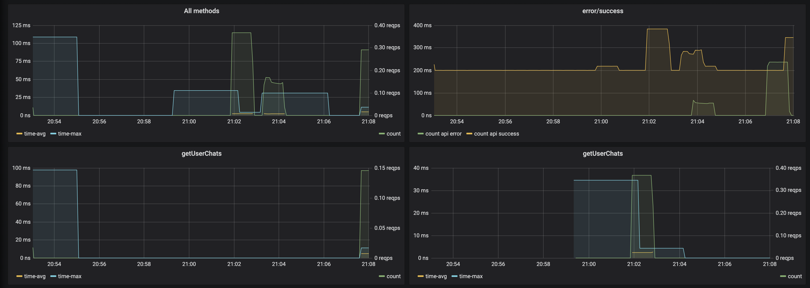
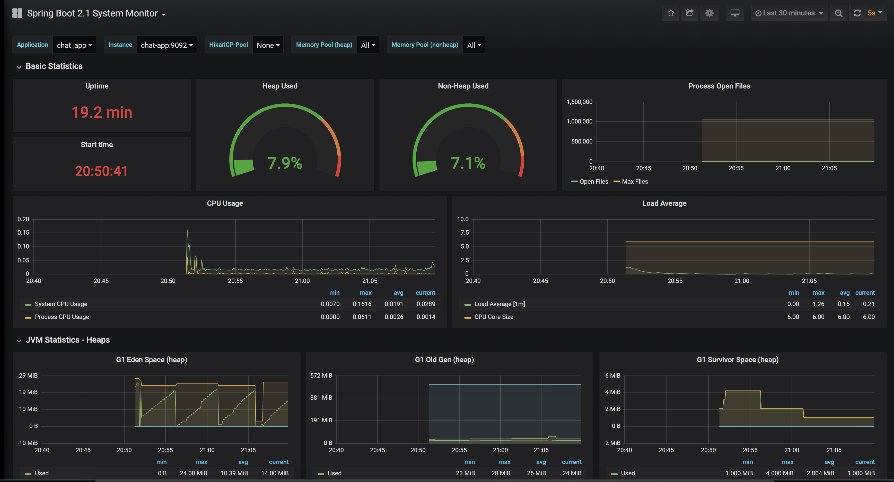
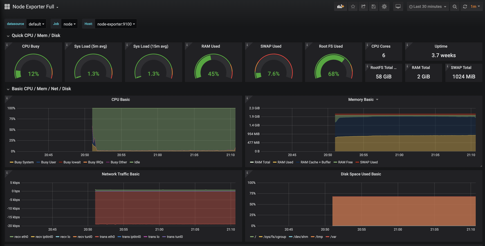
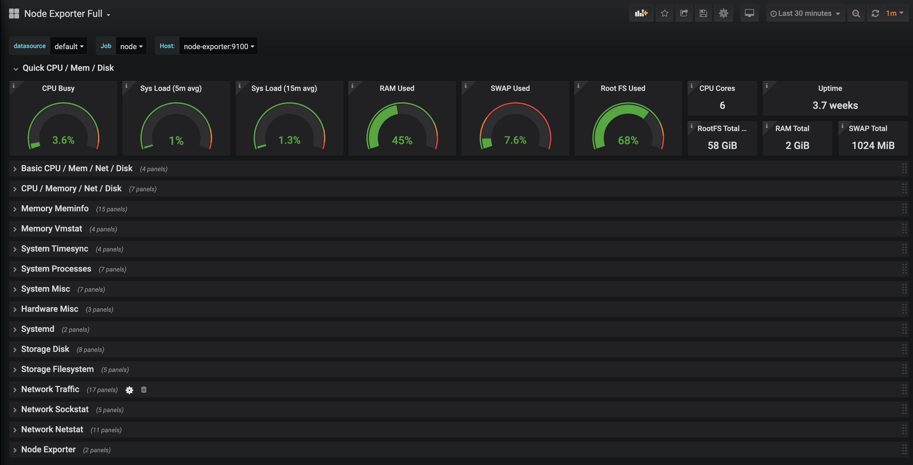
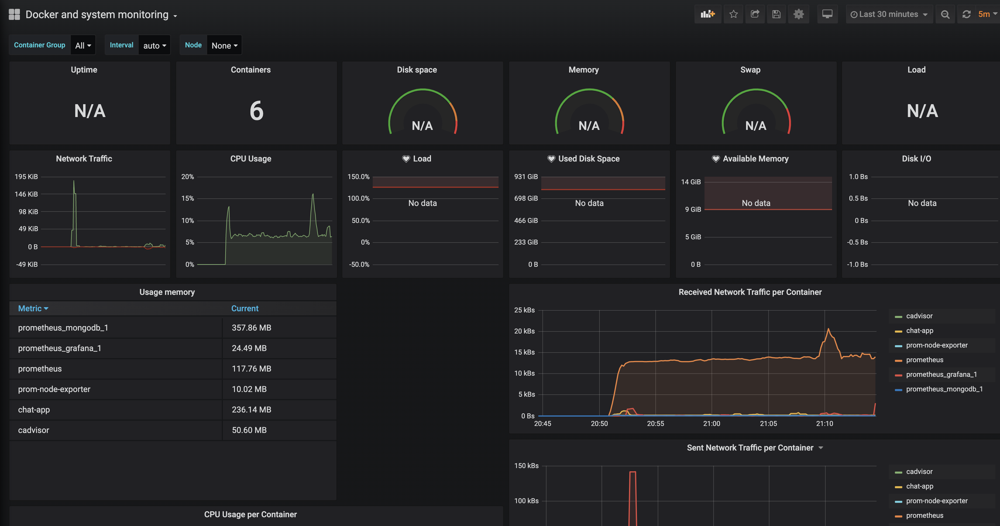

# Мониторинг

- zabbix - [docker-compose](./zabbix-mysql/docker-compose.yml)
- prometheus + grafana [docker-compose](./prometheus/docker-compose.yml)

- бизнес-метрики сервиса чатов по принципу RED

- Spring Boot метрики приложения - Spring Boot 2.1 System Monitor
  - https://grafana.com/grafana/dashboards/11378

- технические метрики сервера с сервисом чатов - Node Exporter Full
  - https://grafana.com/grafana/dashboards/1860

  
  - список доступных технических метрик
  

- Технические метрики контейнеров Docker and system monitoring
  - https://grafana.com/grafana/dashboards/893
  

## Полезные ссылки

- Spring Boot Application - сетевой трафик дашборд - https://grafana.com/grafana/dashboards/9845
- Zabbix: мониторим всё подряд - https://habr.com/ru/post/485538/
- Zabbix Dockerfiles - https://github.com/zabbix/zabbix-docker

