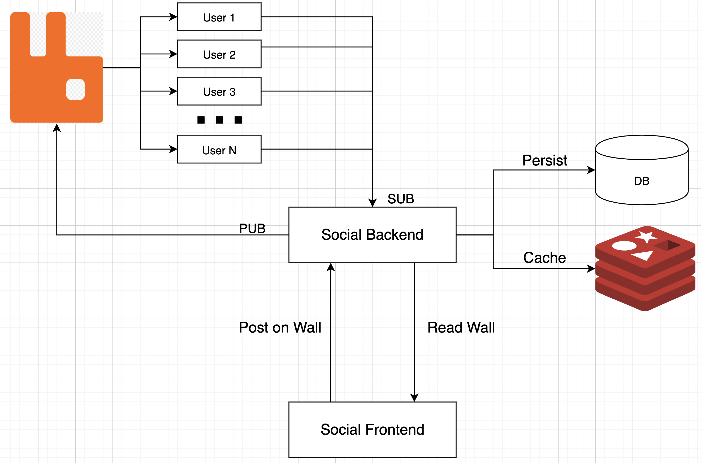

# Лента новостей социальной сети


- Формирование ленты
  - Подписка на посты всех друзей
    - Подписка реализуется чз PUB/SUB RabbitMQ
    - Для каждого пользователя создается очередь
    - Для каждой подписки создается binding
  - нужно хранить channel соединения с очередью хранится в контексте пользователя, и закрывается при разлогине
    - потписки добавляются/убираются (channel.queueUnbind()) если добавлены друзья
    - при аутентификации создается очередь, биндинги подписок всех друзей и происходит subscribe на обновления
  - Все обновления складываются в Redis кэш
  - Схема работы



- Инфраструктура
  - вся инфраструктура описана в [docker-compose](docker-compose.yml)
  - рабочий образ в Docker Hub https://hub.docker.com/r/alexyakovlev90/ay-social
- Redis config
```shell script
maxmemory 1000mb
maxmemory-policy allkeys-lru
```
- доступ http://83.237.169.221:7071/


## Полезные ссылки
- Redis configuration
  - https://github.com/antirez/redis/blob/unstable/redis.conf
  - https://redis.io/topics/config
- Using Redis as an LRU cache
  - https://redis.io/topics/lru-cache
