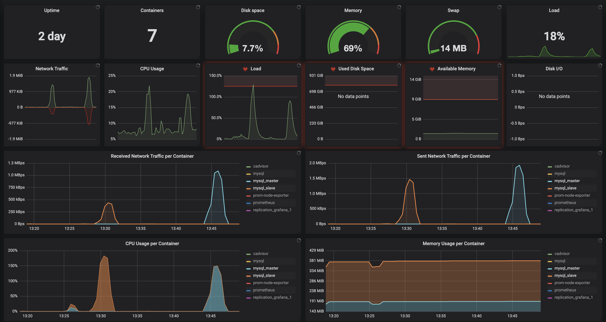

# Настройка и тестирование репликации

1) Поднять cAdvisor, prometheus, node-exporter и grafana для мониторинга локальных контейнеров
```shell script
docker-compose -f replication/docker-compose-monitoring.yml up -d
# убить контейнеры
docker-compose -f replication/docker-compose-monitoring.yml down
```
2) Запустить master-slave Row based репликацию, состоящую из 2х узлов
```shell script
cd replication/docker-mysql-master-slave
./build.sh
```
3) Приложение использует 2 запроса на слэйве
```sql
# Поиск друзей
SELECT * FROM friend_request fr WHERE fr.user_id = ? or fr.friend_id = ?
# Поиск пользователей
SELECT * FROM user WHERE first_name like ? and last_name like ?
```
4) Протестировать нагрузку на master и slave реплики
- для генерации нагрузки на slave был использован скрипт [ДЗ№3](../load-test/hw3-search-report.md)
- для генерации запросов на master [скрипт на Lua](wrk/test-master.lua)
```shell script
# load test slave
wrk -t10 -c100 -d100s -s ./load-test/wrk/search-test.lua --latency http://localhost:9292
# load test master
wrk -t10 -c100 -d100s -s ./replication/wrk/test-master.lua --latency http://localhost:9292
```
- метрики master и slave контейнеров при нагрузке приложения
