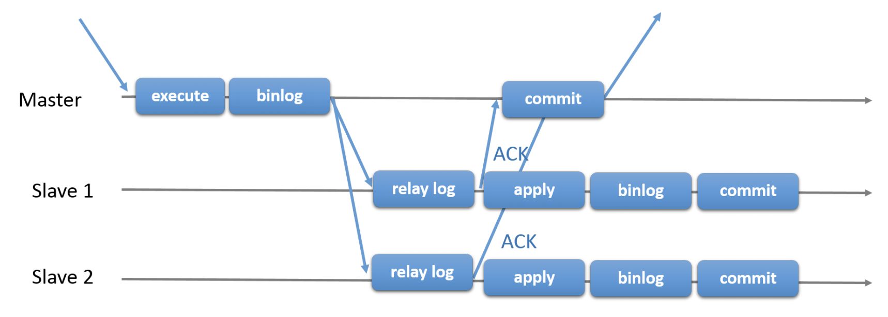

# Настройка и тестирование Полусинхронной репликации

1) Настроить полусинхронную репликацию для 2 слейва и 1 мастер.
  - [скрипт запуска и настройки кластера](docker-mysql-semi-sync/build.sh)

2) Включить row-based репликацию и GTID
  - [Настройка мастера](docker-mysql-semi-sync/master/conf/mysql.conf.cnf) 
  - [Настройка слэйва 1](docker-mysql-semi-sync/slave1/conf/mysql.conf.cnf) 
  - [Настройка слэйва 2](docker-mysql-semi-sync/slave2/conf/mysql.conf.cnf) 

3) Создать нагрузку на запись в любую тестовую таблицу.
  - Нагрузка на запись создавалась в приложении в 8 потоков:
```java
public class ApplicationStart {
...
    public void onApplicationEvent(ContextRefreshedEvent event) {
        int USERS_TO_CREATE = 1000000;
        int BATCH_SIZE = 100;
        ExecutorService executorService = Executors.newFixedThreadPool(8);
        for (int i = 1; i < USERS_TO_CREATE; i++) {
            final int counter = i;
            executorService.execute(() -> {
                List<User> users = IntStream.range(0, BATCH_SIZE)
                        .mapToObj(j -> newRandomUser(j + counter * BATCH_SIZE))
                        .collect(Collectors.toList());
                userMasterRepository.saveAll(users);
                log.info("{} users inserted",  counter * BATCH_SIZE);
            });
        }
    }
}
```

4) С помощью kill -9 убиваем мастер MySQL.
  - Во время нагрузки убиваем контейнер
```shell script
docker rm --force mysql_master
```

5) Выбираем самый свежий слейв. Промоутим его до мастера. Переключаем на него второй слейв.
  - [скрипт промоушена слэйва и настройки второго](docker-mysql-semi-sync/promote.sh)

6) Проверяем, есть ли потери транзакций.
  - Потерь нет. После отключения мастера при большом отставании видел как оставшиеся записи дозаписались
  - Схема полусинхронной репликации
  