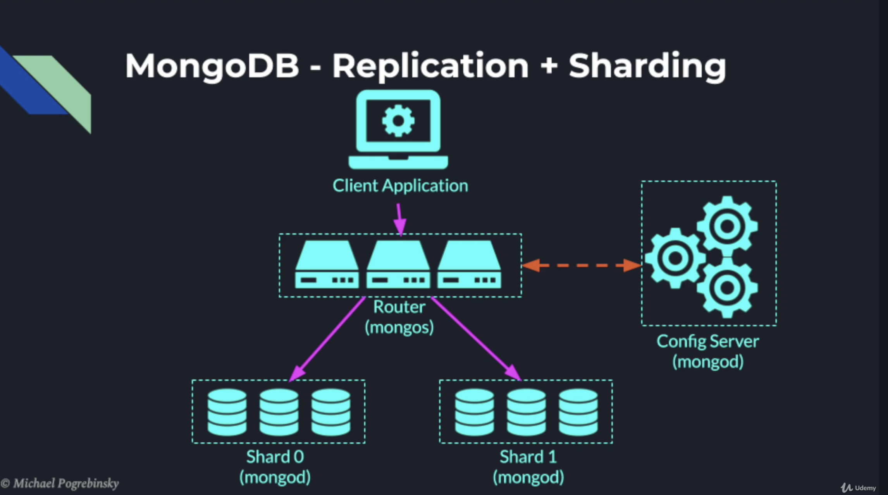

# Масштабируемая подсистема диалогов
---
## Сервис диалогов между пользователями
- Микросервис для обмена сообщениями [social-chat](../social-chat)
- В качестве БД выбрана NoSQL хранилище MongoDB (обоснование ниже)
- Модель Данных разделена на чаты и сообщения, для возможности доработки для групповых чатов
```java
public class ChatDoc {
    private String id;
    private Long fromUser;
    private Long toUser;
    private Long dateCreated;
}
public class MessageDoc {
    private String id;
    private String chatId;
    private Long fromUser;
    private Long dateCreated;
    private String text;
}
```
- API
  - swagger - http://localhost:9090/swagger-ui.html
  - chat-controller
    - POST /api/chats - createChat
    - GET /api/chats/user - getUserChats
  - message-controller
    - GET /api/messages - getMessages
    - POST /api/messages - createMessage

### “Эффект Леди Гаги” (один пользователь пишет сильно больше среднего)
- Для шардирования чатов ChatDoc использован range composed shard key (по создателю чата и дате)
```js
db.chatDoc.createIndex({"fromUser": 1, "dateCreated": -1})
db.shardCollection("social_chat.chatDoc", {"fromUser": 1, "dateCreated": -1})
```
- Для шардирования сообщений использован composed shard key по chatId и dateCreated. 
  Т.к. chatId представляет собой хэш, заполнение шардов будет равномерным
```js
db.messageDoc.createIndex({"chatId": 1, "dateCreated": -1})
sh.shardCollection("social_chat.messageDoc", {"chatId": 1, "dateCreated": -1})
```

---
## Шардирование в MongoDB
- Документация - https://docs.mongodb.com/manual/sharding/
- Шардирование в MongoDB идет из коробки
- Подходит для решардинга в будущем с помощью зон на шардах
- Начиная с MongoDB 4.2 позволяет использовать распределенные транзакции на шардированных кластерах
- Для поддержания равномерного распределения данных в фоне работает балансировщик и равномерно распределяет данные
  - https://docs.mongodb.com/manual/core/sharding-balancer-administration/
- Для шардировния необходимы: 
  - router `mongos` - распределяет запросы, направляемые на разные шарды
  - config server `mongod` - определяет, на каком шарде по какому ключу лежат данные
- router and config server critical and should be run as Replication Set
to guarantee not to have a Single Point of Failure
- Схема шардированного кластера


### Порядок запуска шардированного кластера MongoDB
1. Запуск Config Server Replication Set
- каждый инстанс запускается командой
```shell script
mongod --configsvr --replSet config-rs \
  --port 27020 \
  --bind_ip 127.0.0.1 \
  --dbpath /usr/local/var/mongodb/config-srv-0 \
  --oplogSize 128
```
- --replSet - replication set name
- --dbpath - where to store all files
- --oplogSize - logs for data modification operations for recovery from failures

2. Инициализация Config Server Replication Set
- чтобы объединить все инстансы в Replication Set cluster, 
нужно на первой реплике выполнить команду:
```shell script
rs.initiate({
    _id: "config-rs",
    configsvr: true,
    members: [
        { _id: 0, host: 127.0.0.1:27017 },
        { _id: 1, host: 127.0.0.1:27018 },
          ...
    ]
})
```
3. Запуск шардов (shard nodes)
```shell script
mkdir /usr/local/var/mongodb/shard-0
mongod --shardsvr \
  --port 27017 \
  --bind_ip 127.0.0.1 \
  --dbpath /usr/local/var/mongodb/shard-0 \
  --oplogSize 128
```
4. Запуск `mongos` роутера 
- при запуске необходимо указать адреса всех узлов Config Server Replication Set кластера 
```shell script
mongos --configdb config-rs/host:27020,... --port 27023  --bind_ip 127.0.0.1
```
5. Указать все шарды на роутере `mongos`
- Необходимо подключиться к роутеру и добавить адреса всех шардов
```shell script
mongo --port 27023
sh.addShard("host1:port")
sh.addShard("host2:port")
...
show dbs
```
6. Создать индексы и стратегию шардирования
  - Инструкции нужно выполнять на `mongos` сервере
  - Индексы описаны выше

### Запуск с Docker Compose
- Использован кластер MongoDB
  - https://github.com/chefsplate/mongo-shard-docker-compose
После запуска подключаемся к роутеру и выполняем 
```shell script
# create and swithch to DB
use social_chat
# enable sharding
sh.enableSharding("social_chat")

# create composite range index and sharding for chat
db.chatDoc.createIndex({'from' : 1, 'dateCreated': -1})
sh.shardCollection("social_chat.chatDoc", {{'from' : 1, 'dateCreated': -1})
# create composite range index and sharding for message
db.messageDoc.createIndex({"chatId": 1, "dateCreated": -1})
sh.shardCollection("social_chat.messageDoc", {"chatId": 1, "dateCreated": -1})
```

### Возможность решардинга
- Решардинг в MongoDB осуществляется с помощью Зон
  - https://docs.mongodb.com/manual/core/zone-sharding/
- Для этого необходимо на каждый шард навешивать 1 или более зон, с диапазоном значений
  Таким образом, при добавлении новых шардов можно перемещать зоны со старого шарда на новый
  При использовании зон необходимо отключить собственный балансировщик MongoDB, который
  используется для поддержания равномерного распределения данных
- Документация по работе с зонами
  - https://docs.mongodb.com/manual/tutorial/manage-shard-zone/


## Полезные ссылки по теме
- Индексы
  - https://docs.mongodb.com/manual/indexes/#index-types
- Шардинг в MongoDB
  - https://docs.mongodb.com/manual/sharding/
- Дезайн twitter like Social Inboxes in MongoDB
  - https://www.mongodb.com/blog/post/schema-design-for-social-inboxes-in-mongodb
- Транзакции в монго https://habr.com/ru/post/417131/
