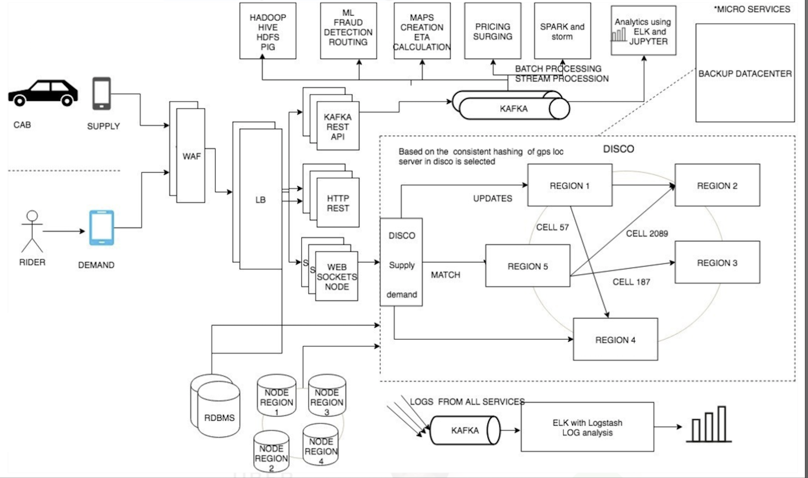
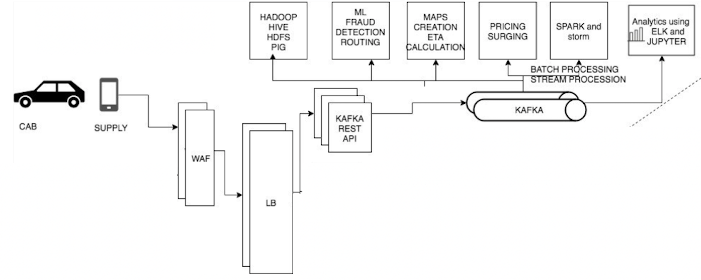
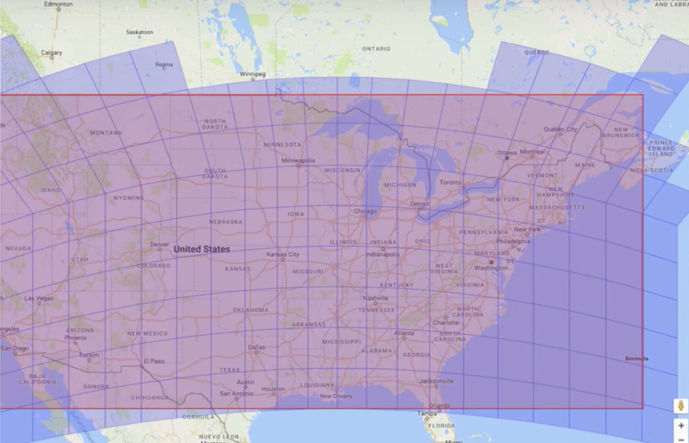
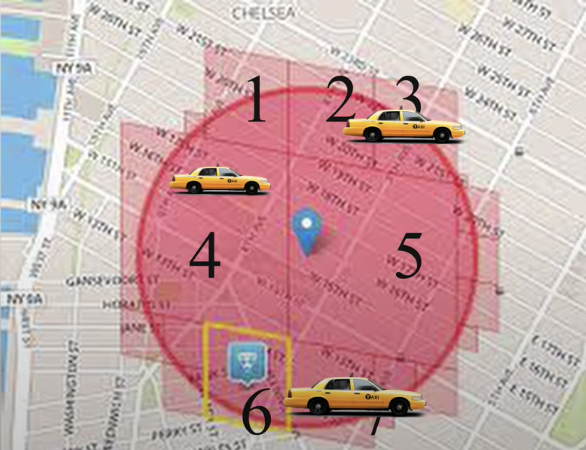
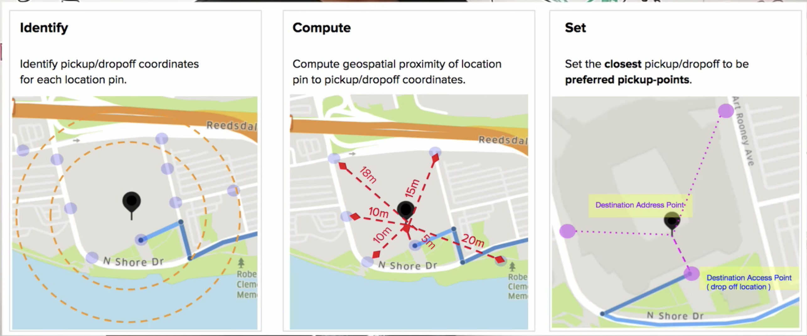

# Анализ чужого сервиса - Uber

## Что и себя представляет сервис
1) Сервис такси - основное направление деятельности
  - подбор клиентам машин (demand - спрос)
  - подбор водителям клиентов (supply - предложение)
  - основная задача - матчинг спроса и предложения (realtime marketplace)
  - использование GPC и мобильного приложения для матчинга в целевых зонах
2) Доставка грузов, еды итд - вторичная деятельность
3) Autonomous Driving - новое большое направление Driver-less taxi

## Верхнеуровневая архитектура
- изначально начинали с монолита
- сегодня имеют микросервесную архитектуру. 
- Кличество микросервисов превышает 2.200 - https://eng.uber.com/microservice-architecture/

- Верхнеровнево система выглядит следующим образом (Сервис такси)

- Как происходит обработка заказа
  - пользовотель (клиент) отправляет реквест на поездку
  - по вебсокету запрос попадает на Demand Service
  - Demand Service исходя из запроса определяет, что нужно сделать 
    - рассчитать стоимость, 
    - найти подходящие авто, 
    - построить маршрут
  - Demand Service отправляет запрос в Supply Service для поиска подходящего авто в требуемой локации
  - Supply Service зная ID сегмента в Google S2, отправляет в распределенный 
  - Dispatcher сервис отправляет запрос на вычисление подходящих водителей в требуемых сегментах, используя ETA сервис
  - Получая ответ Supply Service по WS отправляет предложения рассчитаным водителям
  - После аксепта водителем поездки ответ клиенту отправляется через Demand Service

#### Сервисы водителя объеденены в Supply service
1) API для водителей, доступная снаружи и умеющая послать push по вебсокетам
  - Центр коммуникации с водителем
  - Используется Request Tracking, чтобы посылать уведомления водителю о получении заказа
  - Не имеет состояния
  
2) Сервис-логика со всеми данными по водителям (контакты, рейтинг, имя и т.п.)
  - Хранит персональные водителей клиентов — надо охранять
  - Хранит ценные данные, потери недопустимы
  - Относительно редко меняется и редко добавляются новые данные
  
  
#### Сервисы клиента объеденены в Demand service
1) API для клиентов, доступная снаружи и умеющая послать push по вебсокетам
  - Центр связи с клиентом
  - Используется Request Tracking, чтобы посылать уведомления клиенту о смене статуса заказа
  - Не имеет состояния
  
2) Сервис-логика со всеми данными по клиентам (контакты, рейтинг, имя и т.п.) 
  - Хранит персональные данные клиентов — надо охранять
  - Хранит ценные данные, потери недопустимы
  - Относительно редко меняется и редко добавляются новые данные
  
3) Driver Tracking Service — получает информацию о местоположении всех водителей
  - Каждый водитель раз в 4 секунды отправляет свои координаты
    - Запрос идет на файрволл WAL (Web-application firewall)
    - далее на балансировщик
    - далее в сервис Kafka REST, содержащий нужные методы
    - затем попадает в топик Kafka
    - Из Кафки данные читаются различными сервисами
   
  - позволяет искать автомобили по идентификатору или в указанном радиусе от указанных кооординат
  - Данных относительно немного (по числу активных автомобилей в данный момент)
  - Данные часто модифицируются и очень часто запрашиваются
  - При потере данных они будут восстановлены за несколько минут

#### Сервисы, объединенные в dispatch optimization сервис
1) DISCO (dispatch optimization) - система диспетчеризации
- Моделирование карты и локаций
- Для работы с данными используется не только широта/долгота. но также геосервис Google S2 library.
  - Google S2 library - разбивает карту на сегменты с уникальным ID
  
    - Такой подход используется с целью распределенного хранения (доступ к данным по ID).
    - Для хранения сегментов используется консистентное хэширование.
  
2) Estimation Service — оценивает расстояние и время поездки по двум точкам 
  - пользуется внешним сервисом для карт, пробок и построения маршрутов
  - Используется, как перед заказом, чтобы показать пользователю примерное время ожидания подачи автомобиля, 
    так и для финальных подсчетов стоимости
  - Для поиска авто необходимый радиус покрывается сегментами
  
  - Вычисляется Routing расстояние на карте - estimated times of arrival (ETA)
  - Доступные авто сортируются по ETA
  - отправляем нотификации водителям  
  - Кеширует то, что насчитал (расстояния и время поездки). Имеет два кеша:
    - С учетом пробок — быстро устаревает
    - Без учета пробок — очень медленно устаревает, может использоваться, как фолбек

3) Matching Service — подыскивает свободный автомобиль по запросу, учитывает
  - данные о местоположении водителей, 
  - время подачи (Estimation Service)
  - себестоимость подачи (Billing Service)
  - пожелания клиента
  - Не имеет постоянного состояния
  
4) Request Tracking Service — регистрирует все запросы, гарантирует, что все запросы будут проведены до конца
  - Ведет все запросы от начала и до конца
  - Повторяет все запросы, если давно не было результата
  - Падение ноды не тряет запрос — его подхватывают другие ноды
  - Состояние сохраняется в надежном сторадже с поддержкой транзакций
  
5) Распределение вычислений маршрутов в Dispatcher сервисе 
  - В качестве языка используется Node js, для распределенных вычислений используют ringpop
    - https://github.com/uber-node/ringpop-node
    - ringpop - это RPC протоколб использующий под капотом Gossip протокол SWIM и консистентное хэширование
    - Про SWIM - https://www.brianstorti.com/swim/
  - При добавлении новых городов и локаций масштабируется число нод в рамках хэш кольца

6) Preferred Access Point 

  - Определение точки посадки
  - Для определения мест посадки используются ML алгоритмы

#### Остальные сервисы, аналитика, билинг, история

1) Maps ETA Service (estimated times of arrival)
  - выполняет рассчет расстояний с учетом роутинга, скорости авто, пробок итд
  - Рассчет оптимального ETA - необходимо учитывать множество факторов, 
    включая будущие окончания поездки водителями которые едут в места поблизости
  - в Uber используют Google Maps API (Какое то время использовали Graph Hooper)

2) Fraud ML Service
  - отслеживание мошенников
  - использование приложений с подменой GPS
  - симуляция поездок, требуют после поощрения
  - принимают поездку с другого телефона

3) Pricing (Billing) Service
  - Считает примерную стоимость для отображения клиенту до заказа
  - Считает точную стоимость после размещения заказа
  - Считает, как стоимость для клиента, так и компенсацию водителю
  - Учитывает рейтинги, акции, скидки, бонусы и прочее

4) Analytics
  - Содержит историю заказов за все время
  - Относительно небольшой поток новых записей
  - Недавние записи могут изменяться (например проставление рейтинга, возвраты недовольным клиентам и т.п.), но правки относительно редки
  - Разумно поделить на Warm/Cold хранилища
  - API должен позволять выгрузку для аналитики
  - Считает real-time аналитику по данным с Request Tracking (заказы прямо сейчас) и по History (заказы за сегодня и последнюю неделю)
  - Считает рейтинги водителей и клиентов по многим факторам, включая оценки, но не только
  - Выгружает данные для аналитике по большим промежуткам времени.

## Инфра
1) Database (OLTP)
- Schemaless NoSQL databases 
  - больше пишут, чем читают (координаты каждые 4 сек)
  - используют для более простого горизонтального масштабирования
  - Делят группы инстансов по регионам
  - используют Cassandra, MongoDB
- MySQL 

2) Аналитика (OLAP)
- используют Hadoop (HDFS,HIVE,PIG), читают данные из Kafka, дампают OLTP таблицы

3) Логирование - Kafka + ELK + Grafana

4) Backup Data Center
- Данные не дампаются с рабочих хранилищ. 
- Вместо этого данные сохраняются на мобильном устройстве за заданный рабочий промежуток. 
- Это позволяет при переключени на Backup предоставить всю необходимую информацию для завершения поездки

## Полезные ссылки
- Architecture - https://eng.uber.com/category/articles/architecture/
- SRE
  - https://eng.uber.com/site-reliability-engineering-talks-feb-2016/

